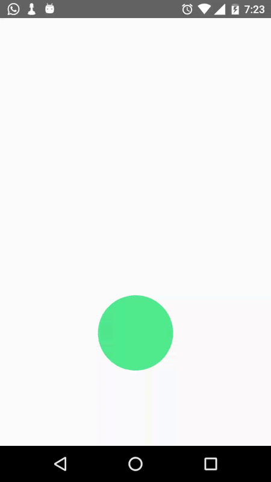
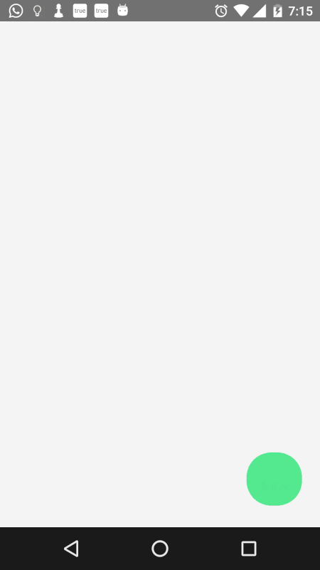
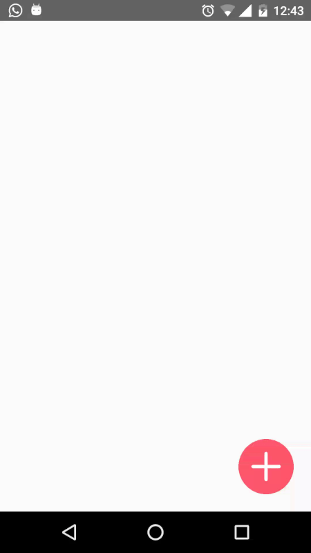

# Morpheus
Morpheus is an Android Library for morphing views. It uses Transition Class introduced in Api level 19 (KitKat).
This project is inspired by [Plaid](https://github.com/nickbutcher/plaid)

This is a bare-bone morphing that it does.

**That's pretty much it. But it has several use cases which I have added as a sample in the project.**

